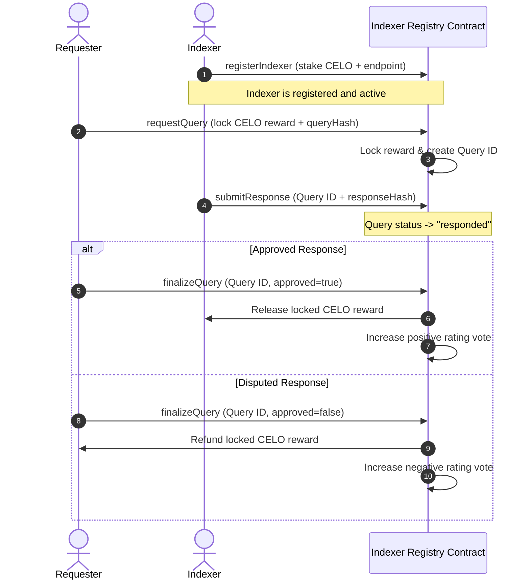

# The Indexer (Celo / Solidity Protocol)

A decentralized indexer registry and query protocol built on the **Celo Blockchain** using the **Solidity Smart Contract Language** and the **Foundry Development Toolchain**.

This repository implements the core on-chain staking registry, query lifecycle (request, response, finalization), reputation/rating mechanism, and slashing logic for indexers on Celo, allowing Celo-native applications to source reliable indexed off-chain data trustlessly.

Author: **rindicomfort** (<kwarpojonathanrindi@gmail.com>)

---

## Architecture Overview



### Core Features

1. **Staking & Registration (`registerIndexer`):** Indexers register their endpoint API URLs by staking a minimum of `100 CELO`. Staking ensures economic commitment and alignment.
2. **Query Lifecycle Management (`requestQuery`, `submitResponse`, `finalizeQuery`):**
   - Requesters lock CELO rewards alongside a cryptographic hash of their query request.
   - Active indexers process the query, compute results, and submit a cryptographic hash of the response on-chain.
   - Requesters verify the response payload off-chain and finalize the query. If correct, the reward is released; otherwise, it is refunded and marked as disputed.
3. **Decentralized Reputation (`getIndexerScore`):** Stores positive and negative performance votes of indexers, helping users select high-performance indexers.
4. **Economic Slashing (`slashIndexer`):** If an indexer behaves maliciously or experiences sustained offline issues, the contract owner can slash a portion of their stake (`50 CELO` default penalty) to protect the network.

---

## Directory Structure

```text
├── foundry.toml          # Foundry settings (Solc 0.8.20+)
├── src/
│   └── IndexerRegistry.sol     # Core Solidity Smart Contract
│   └── indexer-node.js         # Node client script for listening/answering queries
├── test/
│   └── IndexerRegistry.t.sol   # Forge Solidity unit tests
├── package.json          # Node/npm dependency details
└── lib/
    └── forge-std/        # Forge standard library for testing
```

---

## Getting Started

### Prerequisites

Ensure you have the following installed:
- [Foundry](https://book.getfoundry.sh/getting-started/installation) (Forge & Cast)
- [Node.js](https://nodejs.org/) (v18+ recommended)

### Installation

Install Node dependencies (for running the node client daemon):
```bash
npm install
```

### Verification & Testing

Compile smart contracts:
```bash
forge build
```

Run unit tests simulating Celo network:
```bash
forge test
```

Expected output:
```text
Compiler run successful!

Ran 5 tests for test/IndexerRegistry.t.sol:IndexerRegistryTest
[PASS] test_QueryLifecycle_Success() (gas: 423367)
[PASS] test_RegisterIndexer_InsufficientStake_Reverts() (gas: 22820)
[PASS] test_RegisterIndexer_Success() (gas: 214122)
[PASS] test_SlashIndexer_Success() (gas: 192472)
[PASS] test_UpdateEndpoint_Success() (gas: 218858)
Suite result: ok. 5 passed; 0 failed; 0 skipped; finished in 7.94ms
```

### Running the Indexer Node Client

You can run the mock indexer node daemon:
```bash
npm start
```

---

## License
MIT License
